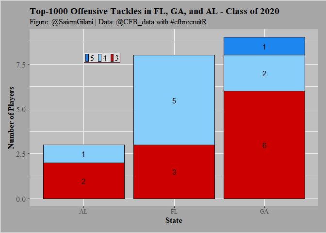

<!-- README.md is generated from README.Rmd. Please edit that file -->

# cfbrecruitR

A college football recruiting package <!-- badges: start -->
<!-- badges: end -->

`cfbrecruitR` is an R package for working with CFB recruiting data. It
is an R API wrapper around
[collegefootballdata’s](https://collegefootballdata.com/) recruiting
and roster endpoints.

**Note:** For details on the data sources, please go the website linked
above. Sometimes there are inconsistencies in the underlying data
itself. Please report issues here or to
<https://collegefootballdata.com/>.

## Installation

You can install `cfbrecruitR` from GitHub with:

``` r
# install.packages("devtools")
devtools::install_github("saiemgilani/cfbrecruitR")
```

## Offensive Tackle Example

This is a basic example which shows you how to solve a common problem:

``` r
library(cfbrecruitR)
library(tidyverse)
#> -- Attaching packages --------------------------------------------- tidyverse 1.3.0 --
#> v ggplot2 3.3.1     v purrr   0.3.4
#> v tibble  3.0.1     v dplyr   1.0.0
#> v tidyr   1.1.0     v stringr 1.4.0
#> v readr   1.3.1     v forcats 0.5.0
#> -- Conflicts ------------------------------------------------ tidyverse_conflicts() --
#> x dplyr::filter() masks stats::filter()
#> x dplyr::lag()    masks stats::lag()
## basic example code
```

Let’s say that we are interested in seeing how many offensive tackles in
the 2020 recruiting cycle were:

  - located in Florida
  - located in the states bordering Florida
  - ranked inside the top 1000

<!-- end list -->

``` r
FL_OTs <- cfb_recruiting(2020, recruit_type = 'HighSchool', state='FL', position ='OT')
GA_OTs <- cfb_recruiting(2020, recruit_type = 'HighSchool', state='GA', position ='OT')
AL_OTs <- cfb_recruiting(2020, recruit_type = 'HighSchool', state='AL', position ='OT')
SE_OTs <- rbind(FL_OTs, GA_OTs, AL_OTs)

SE_OTs_1k <- SE_OTs %>% 
  filter(ranking < 1000) %>% 
  arrange(ranking)

SE_OTs_1k %>% 
  select(ranking, name, school, committedTo, position, 
         height, weight, stars, rating, city, stateProvince)
#>    ranking              name                           school    committedTo
#> 1       11   Broderick Jones                         Lithonia        Georgia
#> 2       37     Tate Ratledge                Darlington School        Georgia
#> 3       72      Myles Hinton Greater Atlanta Christian School       Stanford
#> 4      108   Marcus Dumervil               St. Thomas Aquinas            LSU
#> 5      127      Jalen Rivers                          Oakleaf          Miami
#> 6      156 Issiah Walker Jr.                          Norland        Florida
#> 7      270      Joshua Braun                         Suwannee        Florida
#> 8      317 Connor McLaughlin                           Jesuit       Stanford
#> 9      331      Javion Cohen                          Central        Alabama
#> 10     381     John Williams                        Creekview        Clemson
#> 11     487      Cayden Baker                       Fort Myers North Carolina
#> 12     527     Austin Blaske                  South Effingham        Georgia
#> 13     535   Michael Rankins                          Lennard   Georgia Tech
#> 14     559   Jordan Williams                      Gainesville   Georgia Tech
#> 15     574        Brady Ward             St. Paul's Episcopal       Ole Miss
#> 16     610    Trey Zimmerman                          Roswell North Carolina
#> 17     654     Gerald Mincey                 Cardinal Gibbons        Florida
#> 18     748         Jake Wray                         Marietta       Colorado
#> 19     929      Joshua Jones                          Central       Kentucky
#> 20     948        Wing Green                       Lee County   Georgia Tech
#> 21     966   Kobe McAllister                         Heritage     Cincinnati
#>    position height weight stars rating            city stateProvince
#> 1        OT   77.0    298     5 0.9947        Lithonia            GA
#> 2        OT   78.0    322     4 0.9822            Rome            GA
#> 3        OT   78.0    308     4 0.9666        Norcross            GA
#> 4        OT   77.0    305     4 0.9519 Fort Lauderdale            FL
#> 5        OT   78.0    331     4 0.9429     Orange Park            FL
#> 6        OT   76.0    309     4 0.9311           Miami            FL
#> 7        OT   78.0    335     4 0.9049        Live Oak            FL
#> 8        OT   79.0    260     4 0.8969           Tampa            FL
#> 9        OT   77.0    295     4 0.8954     Phenix City            AL
#> 10       OT   77.0    295     3 0.8891          Canton            GA
#> 11       OT   78.0    260     3 0.8789      Fort Myers            FL
#> 12       OT   77.0    278     3 0.8759          Guyton            GA
#> 13       OT   77.0    295     3 0.8755          Ruskin            FL
#> 14       OT   78.0    310     3 0.8742     Gainesville            GA
#> 15       OT   79.0    310     3 0.8729          Mobile            AL
#> 16       OT   78.0    294     3 0.8709         Roswell            GA
#> 17       OT   77.0    320     3 0.8681 Fort Lauderdale            FL
#> 18       OT   77.0    300     3 0.8643        Marietta            GA
#> 19       OT   76.5    304     3 0.8559     Phenix City            AL
#> 20       OT   79.0    285     3 0.8552        Leesburg            GA
#> 21       OT   78.0    275     3 0.8551        Ringgold            GA
```

You can also create a plot:

``` r
library(ggplot2)
SE_OTs_1k$stars <- factor(SE_OTs_1k$stars,levels = c(5,4,3,2))

SE_OTs_1k_grp <- SE_OTs_1k %>%
  group_by(stateProvince, stars) %>%
  summarize(players = n()) %>% 
  ungroup()
#> `summarise()` regrouping output by 'stateProvince' (override with `.groups` argument)

ggplot(SE_OTs_1k_grp ,aes(x = stateProvince, y = players, fill = factor(stars))) +
  geom_bar(stat = "identity",colour='black') +
  xlab("State") + ylab("Number of Players") +
  labs(title="Top 1000 Offensive Tackles in FL, GA, and AL - Class of 2020",
       subtitle="Figure: @SaiemGilani | Data: @CFB_data with #cfbrecruitR")+
  geom_text(aes(label = players),size = 4, position = position_stack(vjust = 0.5))+
  scale_fill_manual(values=c("dodgerblue2","lightskyblue","red3","ghostwhite"))+
  theme(legend.title = element_blank(),
        legend.text = element_text(size = 12, margin=margin(t=0.2,r=0,b=0.2,l=-1.2,unit=c("mm")), 
                                   family = "serif"),
        legend.background = element_rect(fill = "grey85"),
        legend.key.width = unit(1.5,"mm"),
        legend.key.size = unit(2.0,"mm"),
        legend.position = c(0.25, 0.84),
        legend.margin=margin(t = 0.4,b = 0.4,l=-1.2,r=0.4,unit=c('mm')),
        legend.direction = "horizontal",
        legend.box.background = element_rect(colour = "#500f1b"),
        axis.title.x = element_text(size = 12, margin = margin(0,0,1,0,unit=c("mm")), 
                                    family = "serif",face="bold"),
        axis.text.x = element_text(size = 10,margin=margin(0,0,1,0,unit=c("mm")), family = "serif"),
        axis.title.y = element_text(size = 12, margin = margin(0,0,0,0,unit=c("mm")), 
                                    family = "serif",face="bold"),
        axis.text.y = element_text(size = 12, margin = margin(1,1,1,1,unit=c("mm")), family = "serif"),
        plot.title = element_text(size = 14, margin = margin(t=0,r=0,b=1.5,l=0,unit=c("mm")),lineheight=-0.5, 
                                  family = "serif",face="bold"),
        plot.subtitle = element_text(size = 12, margin = margin(t=0,r=0,b=2,l=0,unit=c("mm")), 
                                     lineheight=-0.5, family = "serif"),
        plot.caption = element_text(size = 12, margin=margin(t=0,r=0,b=0,l=0,unit=c("mm")),
                                    lineheight=-0.5, family = "serif"),
        strip.text = element_text(size = 10, family = "serif",face="bold"),
        panel.background = element_rect(fill = "grey75"),
        plot.background = element_rect(fill = "grey65"),
        plot.margin=unit(c(top=0.4,right=0.4,bottom=0.4,left=0.4),"cm"))
```


