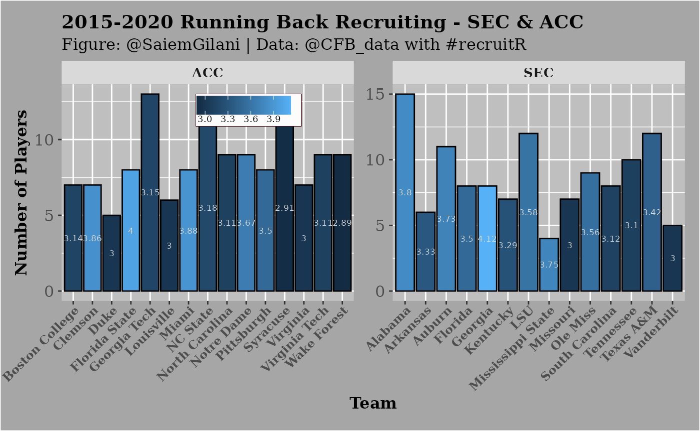

# RBsSECACC5yr

### Running Backs Recruiting 2015-2020: SEC & ACC

This is a basic example which shows you how to solve a common problem:

``` r

if (!requireNamespace('pak', quietly = TRUE)){
  install.packages('pak')
}
pak::pak("sportsdataverse/recruitR")
library(recruitR)

pak::pak(c("dplyr", "ggplot2"))
library(dplyr)
library(ggplot2)
```

Let’s say that we are interested in seeing how teams in either the SEC
or ACC fared in running back recruiting from 2015-2020. We could gather
the information on each conference using the `cfb_recruiting_position`
function, like so:

``` r

sec_positions <- cfbd_recruiting_position(start_year=2015,
                                         end_year = 2020, 
                                         conference = 'SEC')

acc_positions <- cfbd_recruiting_position(start_year=2015,
                                         end_year = 2020, 
                                         conference = 'ACC')

sec_rbs <- sec_positions %>% 
  dplyr::filter(position_group == "Running Back") %>% 
  dplyr::arrange(desc(avg_stars))
acc_rbs <- acc_positions %>% 
  dplyr::filter(position_group == "Running Back") %>% 
  dplyr::arrange(desc(avg_stars))

rbs <- dplyr::bind_rows(sec_rbs,acc_rbs)
print(rbs)
```

    ## ── Recruiting position group info from CollegeFootballData.com ─────────────────

    ## ℹ Data updated: 2026-08-27 17:56:28 UTC

    ## # A tibble: 29 × 7
    ##    team      conference position_group avg_rating total_rating commits avg_stars
    ##    <chr>     <chr>      <chr>               <dbl>        <dbl>   <dbl>     <dbl>
    ##  1 Georgia   SEC        Running Back        0.943         7.54       8      4.12
    ##  2 Alabama   SEC        Running Back        0.919        13.8       15      3.8 
    ##  3 Mississi… SEC        Running Back        0.903         3.61       4      3.75
    ##  4 Auburn    SEC        Running Back        0.903         9.93      11      3.73
    ##  5 LSU       SEC        Running Back        0.901        10.8       12      3.58
    ##  6 Ole Miss  SEC        Running Back        0.896         8.06       9      3.56
    ##  7 Florida   SEC        Running Back        0.898         7.19       8      3.5 
    ##  8 Texas A&M SEC        Running Back        0.888        10.7       12      3.42
    ##  9 Arkansas  SEC        Running Back        0.882         5.29       6      3.33
    ## 10 Kentucky  SEC        Running Back        0.874         6.12       7      3.29
    ## # ℹ 19 more rows

### Plotting the Running Backs

You can also create a plot:

``` r

ggplot(rbs ,aes(x = team, y = commits, fill = avg_stars)) +
  geom_bar(stat = "identity",colour='black') +
  xlab("Team") + ylab("Number of Players") +
  labs(title="2015-2020 Running Back Recruiting - SEC & ACC",
       subtitle="Figure: @SaiemGilani | Data: @CFB_data with #recruitR")+
  geom_text(aes(label = round(avg_stars,2)),color="grey85",
            size = 2.3, position = position_stack(vjust = 0.5))+
  scale_color_gradient2(low = "red",midpoint = 3,mid = "blue",
                        high = "green",space="Lab")+
  facet_wrap(~conference,ncol=2,scales='free')+
  theme(legend.title = element_blank(),
        legend.text = element_text(size = 7, margin=margin(t=0.2,r=3,b=0.2,l=3,unit=c("mm")), 
                                   family = "serif"),
        legend.background = element_rect(fill = "grey99"),
        legend.key.width = unit(.5,"cm"),
        legend.key.size = unit(.5,"cm"),
        legend.position = c(0.3, 0.88),
        legend.margin=margin(t = 0.4,b = 0.4,l=0.1,r=2.7,unit=c('mm')),
        legend.direction = "horizontal",
        legend.box.background = element_rect(colour = "#500f1b"),
        axis.title.x = element_text(size = 12, margin = margin(0,0,1,0,unit=c("mm")), 
                                    family = "serif",face="bold"),
        axis.text.x = element_text(size = 9, margin=margin(0,0,1,0,unit=c("mm")),
                                   face="bold",family = "serif", angle = 45, hjust = 1),
        axis.title.y = element_text(size = 12, margin = margin(0,0,0,0,unit=c("mm")), 
                                    family = "serif",face="bold"),
        axis.text.y = element_text(size = 12, margin = margin(1,1,1,1,unit=c("mm")), 
                                    family = "serif"),
        plot.title = element_text(size = 14, margin = margin(t=0,r=0,b=1.5,l=0,unit=c("mm")),
        lineheight=-0.5, family = "serif",face="bold"),
        plot.subtitle = element_text(size = 12, margin = margin(t=0,r=0,b=2,l=0,unit=c("mm")), 
                                     lineheight=-0.5, family = "serif"),
        plot.caption = element_text(size = 12, margin=margin(t=0,r=0,b=0,l=0,unit=c("mm")),
                                    lineheight=-0.5, family = "serif"),
        strip.text = element_text(size = 10, family = "serif",face="bold"),
        panel.background = element_rect(fill = "grey75"),
        plot.background = element_rect(fill = "grey65"),
        plot.margin=unit(c(top=0.4,right=0.4,bottom=0.4,left=0.4),"cm"))
```



## **Our Authors**

- [Saiem Gilani](https://x.com/saiemgilani)
  [](https://x.com/saiemgilani)
  [](https://github.com/saiemgilani)
- [Ryan Mann](https://x.com/_ryanmann)
  [](https://x.com/_ryanmann)

### **Citation**

To cite the
[**`recruitR`**](https://github.com/sportsdataverse/recruitR) R package
in publications, use:

BibTeX Citation

``` bibtex
@misc{recruitr,
  author = {Saiem Gilani and Ryan Mann},
  title = {recruitR: The SportsDataverse's R Package for College Sports Recruiting Data},
  url = {https://github.com/sportsdataverse/recruitR},
  year = {2026}
}
```

### **Related SportsDataverse packages**

- [**cfbfastR**](https://cfbfastR.sportsdataverse.org/) - college
  football
- [**hoopR**](https://hoopR.sportsdataverse.org/) - men’s basketball
- [**wehoop**](https://wehoop.sportsdataverse.org/) - women’s basketball
- [**baseballr**](https://baseballr.sportsdataverse.org/) - baseball
- [**fastRhockey**](https://fastRhockey.sportsdataverse.org/) - hockey
- [**oddsapiR**](https://oddsapiR.sportsdataverse.org/) - betting odds
- [**sportyR**](https://sportyR.sportsdataverse.org/) - playing surfaces
- [**sportsdataverse-py**](https://py.sportsdataverse.org/) - the Python
  package
- [**sportsdataverse-R**](https://r.sportsdataverse.org/) - the R
  meta-package
