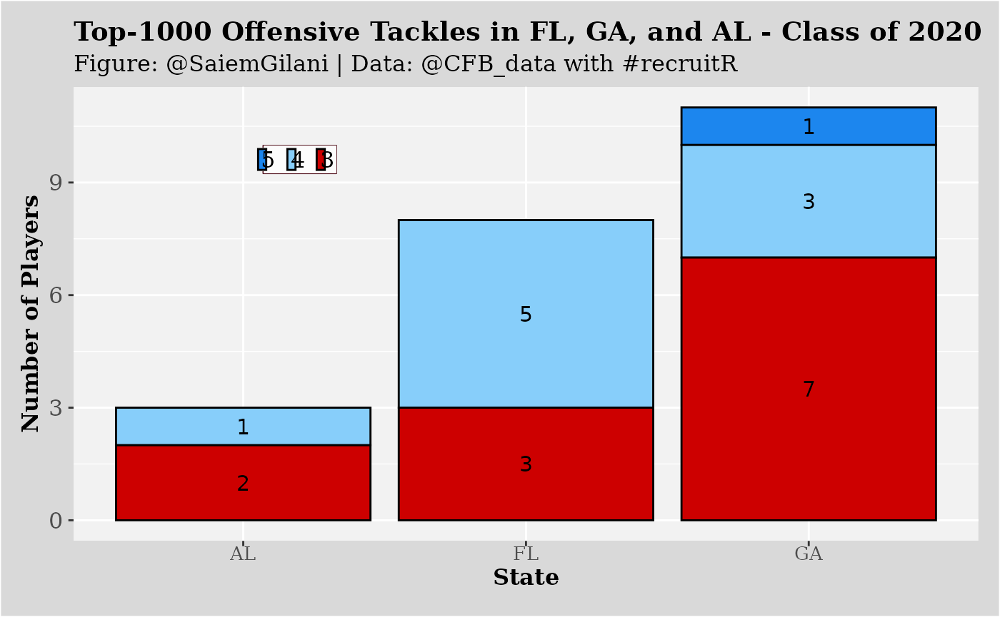

# recruitR

### Offensive Tackle Example

``` r

if (!requireNamespace('pak', quietly = TRUE)){
  install.packages('pak')
}
pak::pak("sportsdataverse/recruitR")
library(recruitR)

pak::pak(c("dplyr", "ggplot2"))
library(dplyr)
library(ggplot2)
```

Let’s say that we are interested in seeing how many offensive tackles in
the 2020 recruiting cycle were:

- located in Florida
- located in the states bordering Florida
- ranked inside the top 1000

``` r

FL_OTs <- cfbd_recruiting_player(2020, recruit_type = 'HighSchool', state='FL', position ='OT')
GA_OTs <- cfbd_recruiting_player(2020, recruit_type = 'HighSchool', state='GA', position ='OT')
AL_OTs <- cfbd_recruiting_player(2020, recruit_type = 'HighSchool', state='AL', position ='OT')
SE_OTs <- dplyr::bind_rows(FL_OTs, GA_OTs, AL_OTs)

SE_OTs_1k <- SE_OTs %>% 
  dplyr::filter(ranking < 1000) %>% 
  dplyr::arrange(ranking)

SE_OTs_1k %>% 
  dplyr::select(ranking, name, school, committed_to, position, 
         height, weight, stars, rating, city, state_province)
#> ── Player recruiting info from CollegeFootballData.com ─────── recruitR 0.0.3 ──
#> ℹ Data updated: 2026-08-27 17:56:42 UTC
#> # A tibble: 22 × 11
#>    ranking name    school committed_to position height weight stars rating city 
#>      <int> <chr>   <chr>  <chr>        <chr>     <dbl>  <int> <int>  <dbl> <chr>
#>  1      11 Broder… Litho… Georgia      OT           77    298     5  0.995 Lith…
#>  2      38 Tate R… Darli… Georgia      OT           78    322     4  0.982 Rome 
#>  3      74 Myles … Great… Stanford     OT           78    308     4  0.966 Norc…
#>  4     110 Marcus… St. T… LSU          OT           77    305     4  0.952 Fort…
#>  5     128 Jalen … Oakle… Miami        OT           78    331     4  0.942 Oran…
#>  6     158 Issiah… Miami… Florida      OT           76    309     4  0.931 Miami
#>  7     280 Joshua… Suwan… Florida      OT           78    335     4  0.905 Live…
#>  8     304 Connor… Tampa… Stanford     OT           79    260     4  0.901 Tampa
#>  9     325 Javion… Centr… Alabama      OT           77    295     4  0.899 Phen…
#> 10     374 John W… Creek… Clemson      OT           77    295     4  0.893 Cant…
#> # ℹ 12 more rows
#> # ℹ 1 more variable: state_province <chr>
```

### Plotting the Offensive Tackles by State

You can also create a plot:

``` r

SE_OTs_1k$stars <- factor(SE_OTs_1k$stars,levels = c(5,4,3,2))

SE_OTs_1k_grp <- SE_OTs_1k %>%
  dplyr::group_by(state_province, stars) %>%
  dplyr::summarize(players = dplyr::n()) %>% 
  dplyr::ungroup()

ggplot(SE_OTs_1k_grp ,aes(x = state_province, y = players, fill = factor(stars))) +
  geom_bar(stat = "identity",colour='black') +
  xlab("State") + ylab("Number of Players") +
  labs(title="Top-1000 Offensive Tackles in FL, GA, and AL - Class of 2020",
       subtitle="Figure: @SaiemGilani | Data: @CFB_data with #recruitR")+
  geom_text(aes(label = players),size = 4, position = position_stack(vjust = 0.5))+
  scale_fill_manual(values=c("dodgerblue2","lightskyblue","red3","ghostwhite"))+
  theme(legend.title = element_blank(),
        legend.text = element_text(size = 12, margin=margin(t=0.2,r=0,b=0.2,l=-1.2,unit=c("mm")), 
                                   family = "serif"),
        legend.background = element_rect(fill = "grey99"),
        legend.key.width = unit(.2,"cm"),
        legend.key.size = unit(.3,"cm"),
        legend.position = c(0.25, 0.84),
        legend.margin=margin(t = 0.4,b = 0.4,l=-1.2,r=0.4,unit=c('mm')),
        legend.direction = "horizontal",
        legend.box.background = element_rect(colour = "#500f1b"),
        axis.title.x = element_text(size = 12, margin = margin(0,0,1,0,unit=c("mm")), 
                                    family = "serif",face="bold"),
        axis.text.x = element_text(size = 10, margin=margin(0,0,1,0,unit=c("mm")),
                                   family = "serif"),
        axis.title.y = element_text(size = 12, margin = margin(0,0,0,0,unit=c("mm")), 
                                    family = "serif",face="bold"),
        axis.text.y = element_text(size = 12, margin = margin(1,1,1,1,unit=c("mm")), 
                                    family = "serif"),
        plot.title = element_text(size = 14, margin = margin(t=0,r=0,b=1.5,l=0,unit=c("mm")),
        lineheight=-0.5, family = "serif",face="bold"),
        plot.subtitle = element_text(size = 12, margin = margin(t=0,r=0,b=2,l=0,unit=c("mm")), 
                                     lineheight=-0.5, family = "serif"),
        plot.caption = element_text(size = 12, margin=margin(t=0,r=0,b=0,l=0,unit=c("mm")),
                                    lineheight=-0.5, family = "serif"),
        strip.text = element_text(size = 10, family = "serif",face="bold"),
        panel.background = element_rect(fill = "grey95"),
        plot.background = element_rect(fill = "grey85"),
        plot.margin=unit(c(top=0.4,right=0.4,bottom=0.4,left=0.4),"cm"))
```



## **Our Authors**

- [Saiem Gilani](https://x.com/saiemgilani)
  [](https://x.com/saiemgilani)
  [](https://github.com/saiemgilani)
- [Ryan Mann](https://x.com/_ryanmann)
  [](https://x.com/_ryanmann)

### **Citation**

To cite the
[**`recruitR`**](https://github.com/sportsdataverse/recruitR) R package
in publications, use:

BibTeX Citation

``` bibtex
@misc{recruitr,
  author = {Saiem Gilani and Ryan Mann},
  title = {recruitR: The SportsDataverse's R Package for College Sports Recruiting Data},
  url = {https://github.com/sportsdataverse/recruitR},
  year = {2026}
}
```

### **Related SportsDataverse packages**

- [**cfbfastR**](https://cfbfastR.sportsdataverse.org/) - college
  football
- [**hoopR**](https://hoopR.sportsdataverse.org/) - men’s basketball
- [**wehoop**](https://wehoop.sportsdataverse.org/) - women’s basketball
- [**baseballr**](https://baseballr.sportsdataverse.org/) - baseball
- [**fastRhockey**](https://fastRhockey.sportsdataverse.org/) - hockey
- [**oddsapiR**](https://oddsapiR.sportsdataverse.org/) - betting odds
- [**sportyR**](https://sportyR.sportsdataverse.org/) - playing surfaces
- [**sportsdataverse-py**](https://py.sportsdataverse.org/) - the Python
  package
- [**sportsdataverse-R**](https://r.sportsdataverse.org/) - the R
  meta-package
